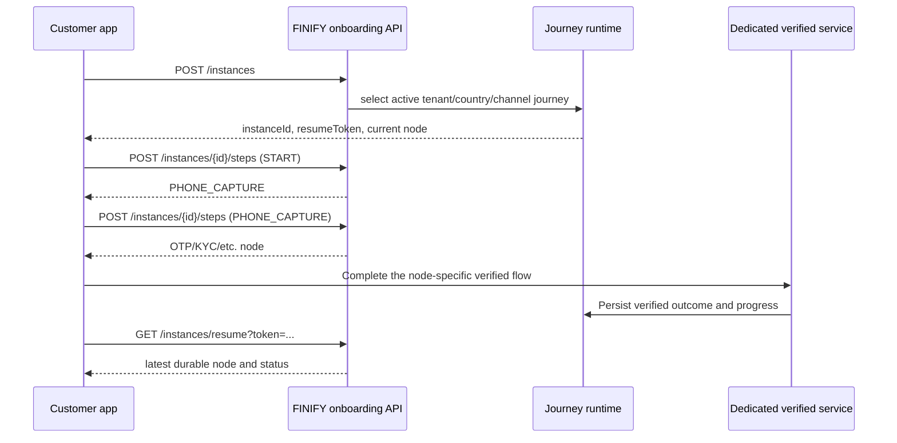

# FINIFY customer onboarding journey API

## Purpose and boundary

This API lets a customer application start or resume a configured onboarding journey, render the current step and submit safe generic progression. FINIFY middleware remains the system of record for registration, consent, KYC, eligibility and channel progress. An LMS is not called merely because onboarding starts; lending begins only when a later, explicit loan application requires it.

The runtime is configuration-driven. The customer app must render and route from `currentNodeType`, `currentNodeKey` and `currentNodeConfiguration`; it must not hard-code a single country or channel journey.

## Postman files

- `postman/Finify-Customer-Onboarding.postman_collection.json`
- `postman/Finify-Customer-Onboarding-Local.postman_environment.json`

Import both files, select **FINIFY Customer Onboarding - Local**, set `tenantId`, use a non-production test phone number and run the requests in numeric folder order. The local base URL uses Kong: `http://localhost:8080/finify`.

Regenerate and validate the files with:

```bash
npm run postman:onboarding
npm run postman:onboarding:validate
```

## Runtime sequence



## Common response envelope

Successful and failed responses use the FINIFY envelope:

```json
{
  "issuccess": true,
  "statusCode": 200,
  "payload": {},
  "message": "Ok"
}
```

Use the HTTP status for transport handling and `payload` for the runtime state. Do not assume the envelope's `statusCode` repeats the HTTP `201` returned by POST routes.

## 1. Start or resume a journey

`POST /api/v1/onboarding/instances`

Headers:

```text
Content-Type: application/json
X-Correlation-ID: <new trace ID>
```

Body:

```json
{
  "tenantId": "00000000-0000-4000-8000-000000000000",
  "countryCode": "UGA",
  "channelCode": "MOBILE_APP",
  "customerType": "INDIVIDUAL",
  "phoneNumber": "+256700000001"
}
```

The values must match an active journey scope. Country codes are ISO 3166-1 alpha-3. Phone numbers use E.164. A matching unexpired in-progress customer journey is resumed and its resume token is rotated.

Example payload:

```json
{
  "instanceId": "2e6d97b7-1778-4ee6-98c6-b2ac7934dca1",
  "customerId": "78ad0394-fce3-47ca-a6be-43c537e2284e",
  "status": "IN_PROGRESS",
  "sourceChannel": "MOBILE_APP",
  "currentChannel": "MOBILE_APP",
  "expiresAt": "2026-09-02T12:00:00.000Z",
  "currentNodeKey": "start",
  "currentNodeType": "START",
  "currentNodeName": "Start",
  "currentNodeConfiguration": {},
  "resumed": false,
  "resumeToken": "<secret token>"
}
```

## 2. Resume durable progress

`GET /api/v1/onboarding/instances/resume?token=<resumeToken>`

The response returns the same runtime view without issuing a new token. A missing, invalid or expired token returns `400` or `404`.

The current GET contract places the token in the URL. Treat it as a bearer-like secret: redact query strings from analytics, crash reports, proxy access logs and support screenshots. A future contract should move resume to a POST or protected header before public production rollout.

## 3. Advance a generic step

`POST /api/v1/onboarding/instances/{instanceId}/steps`

Headers:

```text
Content-Type: application/json
X-Onboarding-Resume-Token: <resumeToken>
Idempotency-Key: <unique key for this logical step>
X-Correlation-ID: <new trace ID>
```

Body:

```json
{
  "nodeKey": "start",
  "outcome": "SUCCESS",
  "output": {}
}
```

`nodeKey` must equal the current node returned by FINIFY. Outcomes are uppercase configured transition codes. `output` must be a JSON object no larger than 16 KB. The idempotency key must contain 8–120 characters.

Reusing the same key with the same logical input returns `replayed: true`. Reusing it with different input returns `409 Conflict`. Generate a new key only when starting a new logical step; retain the previous key while retrying an uncertain network result.

## Node dispatch contract

| `currentNodeType` | Customer-app behaviour |
| --- | --- |
| `START` | Submit `SUCCESS` through the generic step endpoint. |
| `PHONE_CAPTURE` | Confirm the displayed phone and submit `SUCCESS` through the generic step endpoint. |
| `OTP_VERIFICATION` | Invoke the dedicated OTP challenge/verification service. Generic advancement is rejected. |
| `PIN_SETUP` | Invoke the secure PIN service; never place a PIN in generic `output`. |
| `CONSENT` | Render the configured consent version and use the dedicated auditable consent service. |
| `FORM` | Render the configured form and submit through its validated service. |
| `KYC` | Invoke FINIFY KYC/OCR/liveness using the configuration code. |
| `WALLET_ALLOCATION` | Server-side wallet orchestration only. The customer app displays status. |
| `CREDIT_SCORE`, `CREDIT_POLICY`, `LIMIT_ALLOCATION` | Server-side credit orchestration only. The app displays progress/result. |
| `DECISION` | Runtime/server selects a configured outcome; do not let the customer choose it. |
| `CHANNEL_HANDOFF` | Follow the configured secure handoff instruction. |
| `MANUAL_REVIEW` | Display a pending-review state and poll/resume; do not retry generic progression. |
| `END` | Finish locally according to the final runtime status and reason. |

The generic public step endpoint explicitly allows only `START` and `PHONE_CAPTURE`. The dedicated runtime endpoints below validate the resume token, enforce the configured node/version and advance the graph only after durable evidence is written.

## Dedicated verified-node endpoints

All customer requests send `X-Onboarding-Resume-Token`; mutating logical operations also send an 8–120 character `Idempotency-Key`.

| Current node | Endpoint | Contract |
| --- | --- | --- |
| `OTP_VERIFICATION` | `POST /instances/{id}/otp/challenges` | Creates a challenge using the active scoped OTP policy, enforcing expiry, resend and hourly limits. No OTP is returned in production. |
| `OTP_VERIFICATION` | `POST /instances/{id}/otp/verify` | Verifies the code, persists failed attempts/lockout and marks the phone contact verified before automatic advancement. |
| `PIN_SETUP` | `POST /instances/{id}/pin` | Hashes the confirmed PIN with bcrypt and advances. Obvious repeated/sequential PINs are rejected. |
| Any active node | `POST /instances/{id}/pin/verify` | Verifies the stored PIN and applies the configured failed-attempt/15-minute lockout controls. |
| `CONSENT` | `POST /instances/{id}/consents` | Requires the exact active consent version selected by the journey and records content hash, time, IP hash and user-agent hash. |
| `FORM` | `POST /instances/{id}/profile` | Requires the exact active form version and validates required/allowed fields before storing a response hash. |
| `KYC` | `POST /instances/{id}/kyc` | Creates and idempotently links a UUID-principal case in the existing FINIFY KYC module. |
| `KYC` | `POST /instances/{id}/kyc/documents` | Multipart request with `role` and `file`; securely proxies to the existing KYC evidence store. |
| `KYC` | `POST /instances/{id}/kyc/verify` | Starts the existing OCR, face comparison and sanctions workflow. Final maker-checker approval/rejection automatically advances the journey. |
| `KYC` | `GET /instances/{id}/kyc` | Returns a customer-safe status projection without admin credentials or raw internal evidence. |
| `WALLET_ALLOCATION` | `POST /instances/{id}/wallet` | Enforces the active country/channel/customer wallet-product binding, allocates idempotently and advances only after success. |

Server-side providers use `POST /internal/instances/{id}/callbacks` with `X-Onboarding-Callback-Key`. The callback must match the current node type and supplies a stable idempotency key and provider reference.

FINIFY KYC currently performs OCR and still-image face comparison. A still image is not genuine liveness. If `livenessRequired` is configured, bind a certified passive/active liveness provider before activating that KYC configuration.

## 4. Cross-channel handoff

When `currentNodeType` is `CHANNEL_HANDOFF`, create the one-time transfer with:

`POST /api/v1/onboarding/instances/{instanceId}/handoffs`

Send `X-Onboarding-Resume-Token`, `Idempotency-Key` and `X-Correlation-ID`. The optional body is:

```json
{ "expiresInSeconds": 300 }
```

The configured target channel is selected by the server; the customer app cannot override it. The response contains `targetChannel`, `expiresAt` and a signed `handoffToken`. Replaying the same idempotency key returns the same token.

The trusted target client consumes it once with:

`POST /api/v1/onboarding/handoffs/consume`

```json
{ "handoffToken": "<one-time signed token>" }
```

Production target clients also send `X-Finify-Channel-Client-ID` and `X-Finify-Channel-Credential`. Successful consumption revokes the source session, rotates the resume token, records the channel transition and advances only through the configured `SUCCESS` edge. A second consumption returns `409`.

Never carry the source resume token into the target channel or place the handoff token in analytics, logs or third-party URLs.

## Status handling

| Status | Meaning | App action |
| --- | --- | --- |
| `IN_PROGRESS` | Customer or server progression continues. | Render/dispatch the current node. |
| `WAITING_EXTERNAL` | An external verified service is pending. | Show pending state and resume later. |
| `MANUAL_REVIEW` | Operations review is required. | Show review state and resume later. |
| `COMPLETED` | The journey reached `END`. | Continue to the authorised post-onboarding destination. |
| `EXPIRED` | Resume window elapsed. | Restart through `POST /instances`. |
| `CANCELLED` | Journey was stopped. | Show the configured safe termination message. |

## Error handling

| HTTP | Typical cause | Client action |
| --- | --- | --- |
| `400` | Invalid UUID, country, E.164 phone, resume token or idempotency key. | Correct the request; do not retry unchanged. |
| `404` | Instance/resume token missing, invalid or expired. | Restart onboarding or ask the customer to retry entry. |
| `409` | Node changed, outcome invalid, idempotency mismatch, completed journey or dedicated-service boundary. | Fetch current progress and dispatch from the returned node. |
| `429` | Gateway rate limit. | Back off with jitter and respect `Retry-After` when present. |
| `500` | Unexpected server/configuration failure. | Preserve correlation ID, retry safely only with the same idempotency key, and alert operations. |

## Security and mobile implementation rules

- Store the resume token only in the platform secure keystore/keychain. Never put it in application logs, analytics, push notifications or URLs controlled by third parties.
- Treat `instanceId` and `customerId` as identifiers, not authentication credentials.
- Generate a fresh correlation ID per operation and retain it in support diagnostics.
- Do not cache protected step output or PII in plaintext.
- Never submit OTPs, PINs, identity images, bureau data or credit evidence through generic `output`.
- Derive channel/country/tenant settings from signed application configuration in production rather than editable customer input.
- On timeout, retry the same logical step with the same idempotency key. Do not generate a new key until the previous result is known.
- Render from server-provided node configuration but allowlist supported components; never execute configuration as code.

## Production activation gates

The three runtime routes are reachable through Kong under `/finify/api/v1/onboarding` and are rate-limited. Before public production use, complete the following:

1. Bind the OTP challenge to the production SMS adapter and keep `ONBOARDING_OTP_DEV_EXPOSE=false`.
2. Approve and activate the legal consent, customer form, KYC and wallet-product configuration versions using maker-checker governance.
3. Bind a genuine liveness provider when the selected KYC policy requires liveness.
4. Replace the resume-token query parameter with a header or POST body contract.
5. Register trusted production channel clients and enable `ONBOARDING_TRUSTED_CHANNEL_REQUIRED`.
6. Add device and phone velocity controls, define customer-safe rejection codes, and run contract tests for every activated country/channel scope.
